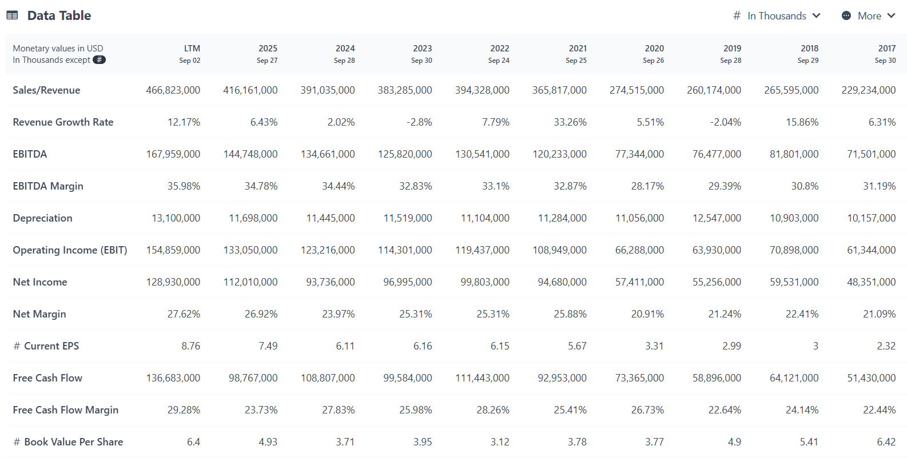

# Data Table

Presents a company's historical financials: revenue, margins, cash flow, and returns in a single, readable table.

Run it at [discountingcashflows.com](https://discountingcashflows.com/)'s model
editor (see the [root README](../README.md) for how). 
Financial data is pulled
from [Financial Modeling Prep](https://financialmodelingprep.com/).

