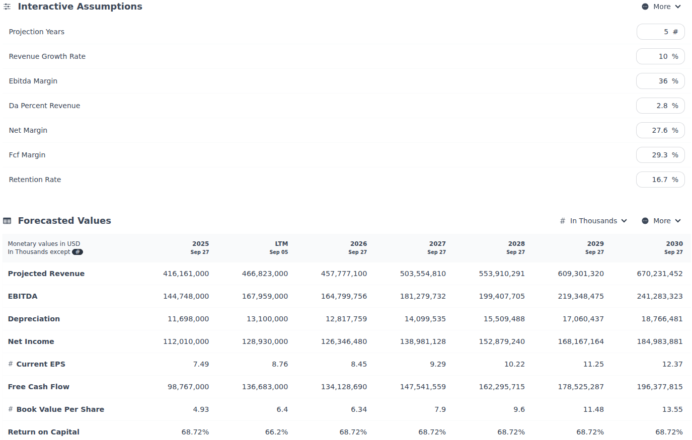

# Forecasting Model

An interactive forecasting model. Projects a company's income statement and free cash flow forward from a small set of editable assumptions, and presents the result in a data table.

Run it at [discountingcashflows.com](https://discountingcashflows.com/)'s model
editor (see the [root README](../README.md) for how — a free account is required).
Financial data is pulled from [Financial Modeling Prep](https://financialmodelingprep.com/).

